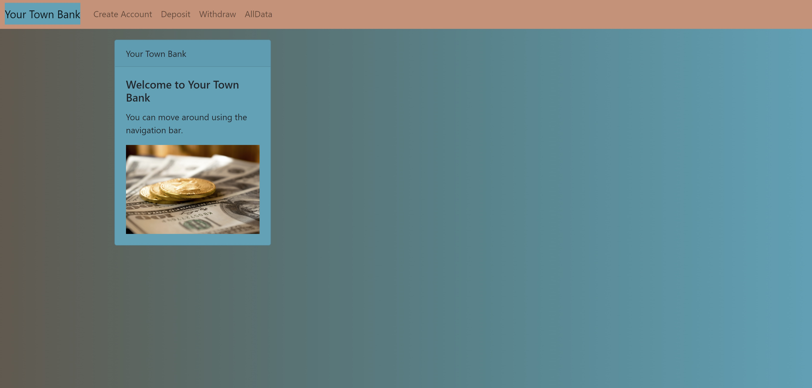

# bank-project

#### Description
Module 2 bank project that uses React, AWS, and everything I used in Module 1 (HTML, Javascript, Boostrap). This is an app to show what I have learned, but could also be used to keep track of allowance or something similar that didn't need security.

 
#### Installation:
 
First, you have to fork the project to your own Github. Then, you would need to have your own AWS account and set up a bucket to put it into, but it would be easier to just check mine out at: https://rebecca-durst-banking-application.s3.amazonaws.com/index.html#/
 
#### Usage:
 
You will be able to create an account and keep track account info. You will also be able to withdraw and deposit into "your account".
 
#### Support: 
 
I would just check the website version if you can't get a cloned version to work.

#### Features:
Watch me walk through the project here: https://www.youtube.com/watch?v=zCzoFa69X7c
I have a Create Account page that has few pop up warnings if you leave blanks. The Deposit page will not let you deposit negative numbers or letters. The Withdraw page will not let you withdraw negative number or letters. Both the Deposit and Withdraw buttons are disabled until an amount is inputted. The tabs along the top highlight as you navigate to the corresponding tab. I have a gradient on the background.
 
#### Roadmap: 
I'd like the website to adjust to the screen size. I would like to add more security and work in my backend knowledge of databases to create a page that stores users and their information.
 
#### License information:
 
MIT license
